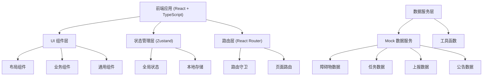

## 1. 架构设计



## 2. 技术选型说明

### 前端技术栈
- **框架**: React 18 + TypeScript
- **构建工具**: Vite 5.x
- **样式方案**: TailwindCSS 3.x
- **路由管理**: React Router DOM 6.x
- **状态管理**: Zustand 4.x
- **UI 组件库**: 自定义组件 + TailwindCSS
- **图标库**: Lucide React
- **图表库**: Recharts (可选，用于分析报表)
- **地图**: 纯前端模拟地图组件 (无外部地图 API 依赖)

### 开发工具
- **包管理器**: npm
- **代码规范**: TypeScript 严格模式
- **构建配置**: Vite 原生配置

## 3. 目录结构

```
src/
├── components/          # 通用组件
│   ├── layout/         # 布局组件
│   │   ├── Sidebar.tsx
│   │   ├── Header.tsx
│   │   └── MainLayout.tsx
│   ├── ui/             # 基础 UI 组件
│   │   ├── Button.tsx
│   │   ├── Card.tsx
│   │   ├── Table.tsx
│   │   ├── Modal.tsx
│   │   ├── Badge.tsx
│   │   └── Input.tsx
│   └── common/         # 业务公共组件
│       ├── StatCard.tsx
│       └── StatusTag.tsx
├── pages/              # 页面组件
│   ├── Dashboard/      # 地图首页
│   ├── Obstacles/      # 障碍物台账
│   ├── PatrolTasks/    # 巡查任务
│   ├── PublicReport/   # 群众上报
│   ├── Inspection/     # 核查处置
│   ├── RiskAssessment/ # 风险评估
│   ├── Announcements/  # 公告管理
│   └── Reports/        # 分析报表
├── store/              # 状态管理
│   └── useAppStore.ts
├── data/               # Mock 数据
│   ├── obstacles.ts
│   ├── tasks.ts
│   ├── reports.ts
│   └── announcements.ts
├── types/              # TypeScript 类型定义
│   └── index.ts
├── utils/              # 工具函数
│   └── helpers.ts
├── App.tsx
├── main.tsx
└── index.css
```

## 4. 路由定义

| 路由路径 | 页面名称 | 说明 |
|---------|---------|------|
| / | 地图首页 | 默认首页，展示地图和统计概览 |
| /obstacles | 障碍物台账 | 障碍物列表、登记、详情 |
| /patrol-tasks | 巡查任务 | 任务列表、路线规划、现场核查 |
| /public-report | 群众上报 | 线索列表、审核、表单 |
| /inspection | 核查处置 | 预警、整改、复查销号 |
| /risk-assessment | 风险评估 | 影响分析、等级评定、热区统计 |
| /announcements | 公告管理 | 公告列表、发布、编辑 |
| /reports | 分析报表 | 数据看板、趋势分析、报表导出 |

## 5. 数据模型定义

### 5.1 障碍物 (Obstacle)
```typescript
interface Obstacle {
  id: string;
  name: string;
  type: 'tower_crane' | 'billboard' | 'building' | 'other';
  height: number;
  latitude: number;
  longitude: number;
  address: string;
  photos: string[];
  ownerUnit: string;
  contactPerson: string;
  contactPhone: string;
  isTemporary: boolean;
  validFrom?: string;
  validTo?: string;
  status: 'normal' | 'warning' | 'overheight';
  riskLevel: 'low' | 'medium' | 'high';
  createdAt: string;
  updatedAt: string;
}
```

### 5.2 巡查任务 (PatrolTask)
```typescript
interface PatrolTask {
  id: string;
  title: string;
  type: 'routine' | 'special' | 'emergency';
  status: 'pending' | 'in_progress' | 'completed';
  assignee: string;
  routePoints: RoutePoint[];
  startTime: string;
  endTime?: string;
  progress: number;
  description: string;
  createdAt: string;
}

interface RoutePoint {
  id: string;
  name: string;
  latitude: number;
  longitude: number;
  order: number;
  checked: boolean;
  checkTime?: string;
  photos?: string[];
  remark?: string;
}
```

### 5.3 群众上报 (PublicReport)
```typescript
interface PublicReport {
  id: string;
  title: string;
  description: string;
  location: {
    latitude: number;
    longitude: number;
    address: string;
  };
  photos: string[];
  reporterName: string;
  reporterPhone: string;
  status: 'pending' | 'reviewing' | 'merged' | 'processing' | 'completed' | 'rejected';
  mergedInto?: string;
  relatedTaskId?: string;
  createdAt: string;
}
```

### 5.4 整改通知 (RectificationNotice)
```typescript
interface RectificationNotice {
  id: string;
  obstacleId: string;
  obstacleName: string;
  title: string;
  content: string;
  responsibleUnit: string;
  contactPerson: string;
  contactPhone: string;
  deadline: string;
  status: 'issued' | 'rectifying' | 'rechecking' | 'completed' | 'overdue';
  issueTime: string;
  rectificationTime?: string;
  recheckTime?: string;
  recheckResult?: string;
  photos: string[];
}
```

### 5.5 公告 (Announcement)
```typescript
interface Announcement {
  id: string;
  title: string;
  content: string;
  type: 'notice' | 'warning' | 'policy';
  status: 'draft' | 'published' | 'archived';
  publishTime?: string;
  author: string;
  views: number;
  createdAt: string;
}
```

## 6. 状态管理设计

```typescript
interface AppState {
  // 侧边栏状态
  sidebarCollapsed: boolean;
  toggleSidebar: () => void;
  
  // 当前用户
  currentUser: User | null;
  
  // 全局通知
  notifications: Notification[];
  addNotification: (n: Omit<Notification, 'id' | 'createdAt'>) => void;
  removeNotification: (id: string) => void;
}
```

## 7. 核心组件设计原则

1. **单一职责**: 每个组件只负责一个功能
2. **可复用性**: 提取通用 UI 组件，避免重复代码
3. **类型安全**: 全面使用 TypeScript 类型定义
4. **性能优化**: 合理使用 useMemo、useCallback
5. **无障碍**: 使用语义化 HTML，添加必要的 ARIA 属性
